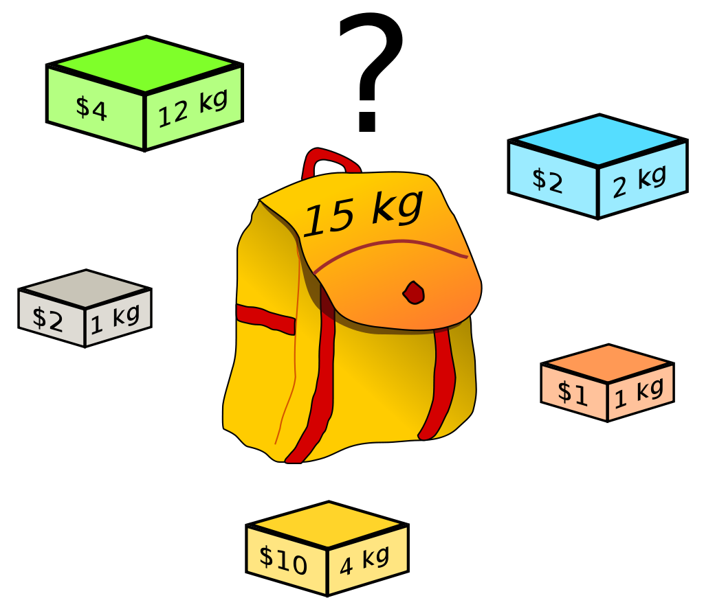
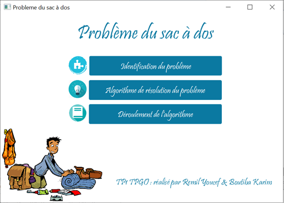

# Knapsack-problem



The knapsack problem is a classic optimization problem in computer science and mathematics. It involves trying to fit a set of items into a knapsack, with each item having a certain weight and value. The goal is to maximize the value of the items included in the knapsack while keeping the total weight of the items below or equal to the knapsack's capacity.
More formally, given a set of n items, each with a weight w_i and a value v_i, and a knapsack with a maximum capacity of W, the problem is to find a subset of the items such that the total value of the selected items is maximized subject to the constraint that the total weight of the selected items does not exceed W. In the 0-1 variant of the problem, each item can be either included or excluded from the subset, whereas in the unbounded variant, each item can be included any number of times.


# Proposed Algorithm using Dynamic Programming 
This problem can be formulated in different ways, but one common approach is to use dynamic programming, here is the proposed algorithm used in this repository

```
// Input:
// Values (stored in array v)
// Weights (stored in array w)
// Number of distinct items (n)
// Knapsack capacity (W)
// NOTE: The array "v" and array "w" are assumed to store all relevant values starting at index 1.

array m[0..n, 0..W];

for j from 0 to W do:
    m[0, j] := 0

for i from 1 to n do:
    m[i, 0] := 0

for i from 1 to n do:
    for j from 0 to W do:
        if w[i] > j then:
            m[i, j] := m[i-1, j]
        else:
            m[i, j] := max(m[i-1, j], m[i-1, j-w[i]] + v[i])
```

# A Software tool for interactive use built with Java and JavaFX in French



